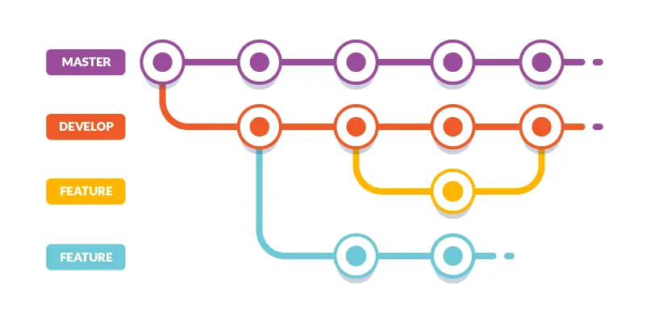

# project_pa2

## Proje Açıklaması
Bu proje, Git ve GitHub kullanımını öğrenmek amacıyla oluşturulmuştur. Proje, koordinat verilerini işleyen basit bir Python programı içerir. Proje, Git komutlarının nasıl kullanılacağını ve GitHub üzerinde nasıl çalışılacağını anlamak için tasarlanmıştır.

## Proje Yapısı
Proje klasörü aşağıdaki dosya ve klasörleri içerir:
- **`coordinates.csv`**: Koordinat bilgilerini içeren CSV dosyası.
- **`point.py`**: Koordinatları okuyup ekrana yazdıran Python kodu.
- **`img/`**: Projeyle ilgili resimlerin bulunduğu klasör.
- **`tests/`**: Test dosyalarının bulunduğu klasör (şimdilik boş).
- **`README.md`**: Projeyi anlatan bu belge.

## Resimler
Projeyi daha iyi anlamak için aşağıdaki diyagramı kullanabilirsiniz:


## Tablo Örneği
Aşağıda `coordinates.csv` dosyasındaki verilerin bir örneği bulunmaktadır:

| x  | y  | z  |
|----|----|----|
| 1  | 2  | 3  |
| 4  | 5  | 6  |
| 7  | 8  | 9  |
| 10 | 11 | 12 |

## Kullanılan Git Komutları
Proje boyunca aşağıdaki Git komutlarını kullandım:
- **`git clone`**: Repo'yu bilgisayarıma indirdim.
- **`git add`**: Dosyaları Git'e ekledim.
- **`git commit`**: Değişiklikleri kaydettim.
- **`git push`**: Değişiklikleri GitHub'a gönderdim.
- **`git pull`**: Uzak depodaki değişiklikleri lokal depoma çektim.

## Local Git vs GitHub
- **Local Git**: Tüm değişiklikler lokal bilgisayarımda yapılır ve kaydedilir. Bu, projeyi kişisel olarak yönetmek için kullanılır.
- **GitHub**: Değişiklikler uzak sunucuda (bulut) saklanır ve paylaşılır. Bu, ekip çalışması ve projeyi dünyaya açmak için kullanılır.

## Karşılaştığım Zorluklar
- **Git komutlarını öğrenmek**: İlk başta Git komutlarını öğrenmek biraz zaman aldı, ancak pratik yaparak alıştım.
- **Yetkilendirme hatası**: `git push` yaparken yetkilendirme hatası aldım. Bu sorunu, GitHub token kullanarak çözdüm.
- **Commit birleştirme**: Birden fazla commit'i birleştirmek istediğimde `git rebase` komutunu öğrenmem gerekti.

## Commit Yapma Kararı
- **Yeni özellik eklediğimde**: Örneğin, `point.py` dosyasına yeni bir fonksiyon eklediğimde commit yaptım.
- **Hata düzelttiğimde**: Bir hatayı çözdüğümde commit yaptım.
- **Dosya eklediğimde**: Yeni bir dosya eklediğimde (örneğin `README.md`) commit yaptım.

## AI Kullanımı
Proje boyunca yapay zeka (AI) araçlarını kullanarak bazı sorularıma cevap buldum. Özellikle ChatGPT'yi kullanarak Git komutları hakkında bilgi aldım.
- **Soru**: "Git'te commit'leri nasıl birleştirebilirim?"
- **Platform**: ChatGPT
- **Öğrendiklerim**: `git rebase` komutunu kullanarak commit'leri birleştirmeyi öğrendim. Ayrıca, `git merge` ve `git rebase` arasındaki farkları anladım.

---

## Nasıl Çalıştırılır?
Projeyi çalıştırmak için aşağıdaki adımları izleyin:
1. Terminalde proje klasörüne gidin:
   ```bash
   cd path/to/project_pa2